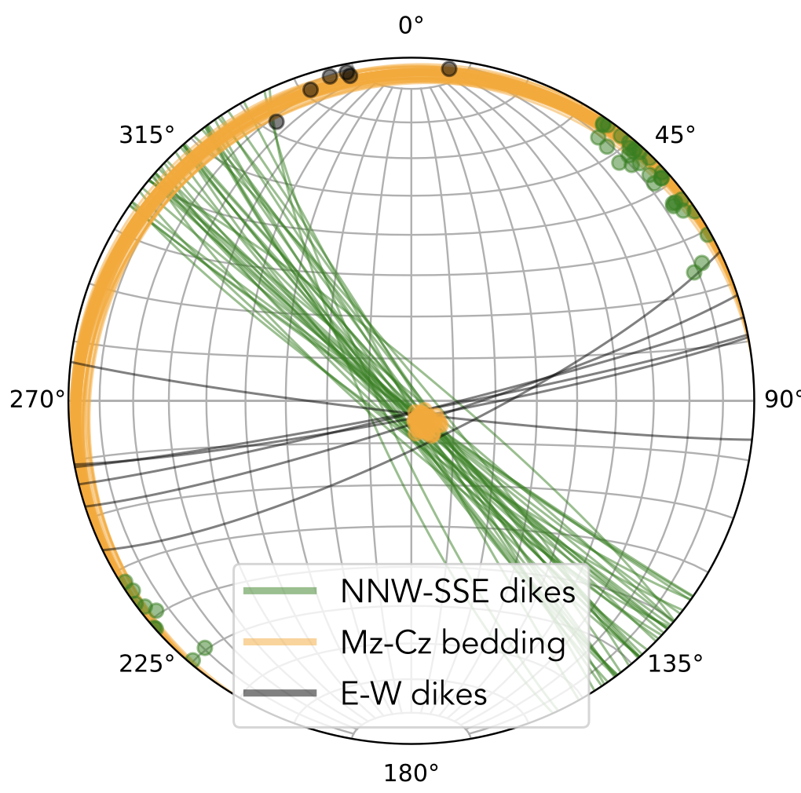

# 2025 Oman Paleogeography
Repository of code and data associated with study of Tonian Shaat dikes of Oman as described in the manuscript:

## Oman was on the northern margin of a wide late Tonian Mozambique Ocean
Nicholas L. Swanson-Hysell1, Yiming Zhang1, Francis A. Macdonald2,  
Isabel Koran2, Adrian R. Tasistro-Hart2, Annabel F. Jay3  

---

1 Department of Earth and Environmental Sciences, University of Minnesota, Minneapolis, MN, USA  
2 Department of Earth and Planetary Science, University of California, Berkeley, CA, USA  
3 Department of Geology, Carleton College, Northfield, MN, USA  

## Code

### dike_orientations.ipynb

This notebook aggregates structural orientation field data collected for planes of Shaat dikes and from the overlying Mesozoic-Cenozoic carbonates. Fisher means are calculated for the plane poles of dikes to derive the mean strike and dip of dike planes. These data are visualized for every dike for which data were collected and used to determine the overall orientation of the population. The stereonet used in the manuscript an output from this code:

### dike_paleomagnetism

This notebook

### MagIC_contribution

This notebook imports the separate MagIC file export for the paleomagnetic thermal demagnetization data and the rock magnetic experiments.

## Data

### APWP

The file `Torsvik2012a_Gondwana_APWP.csv` provides context for the 540 Ma and onward path for Gondwana

### field_data

This folder contains structural orientation data as well as additional metadata including higher precision GPS locations for the paleomagnetic sites.

### pmag

This folder contains paleomagnetic and rock magnetic data generated for project research.

#### demag

This folder is the data as analyzed in and exported from Demag_GUI.

#### demag_enhanced

This folder contains enhanced metadata that enriches the MagIC tables generated in the folder demag.

#### rockmag

This folder contains the MagIC file exported from the IRM database containing the results from rock magnetic experiments

#### zircon_U-Pb

This folder contains the `LASS ICPMS U-Pb.xlsx` spreadsheet with the U-Pb data.
